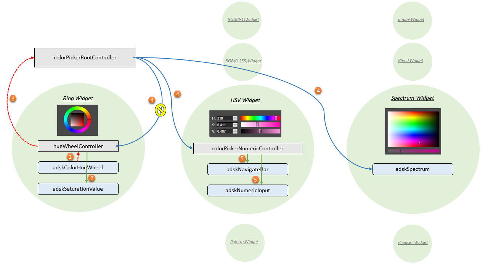
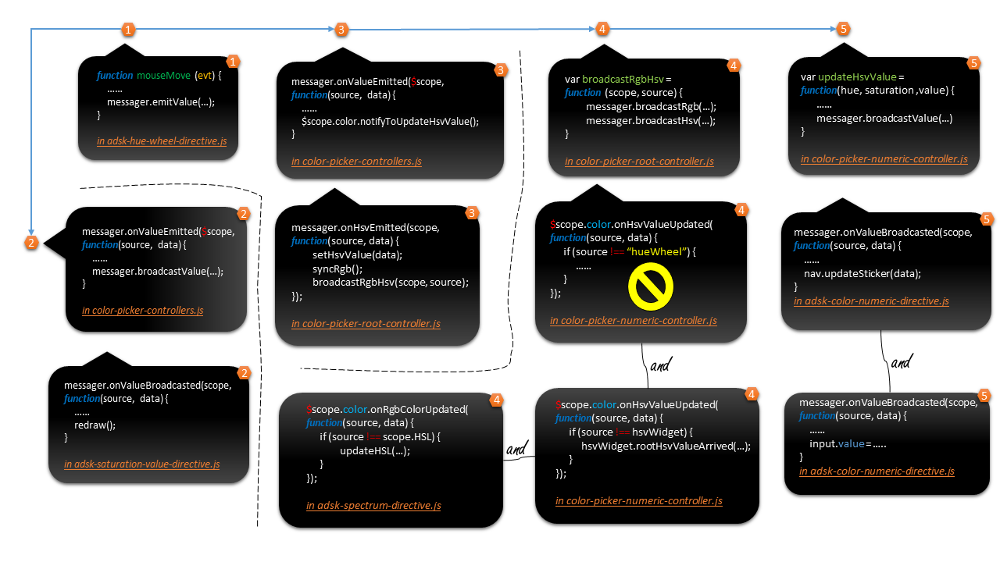

# Implementation Document

## Some Backgrounds

Basically all we are new to Javascript/JQuery/Angular/HTML/CSS, and there must be many pitfalls/misuses in the code. And this fact actually has an impact on some strategies as well. For example, most code uses Closure system instead of Prototype system to mimic the Object-Oriented feature in Javascript, since "this" pointer in JS always get me killed and in the meantime the Closure seems very powerful and elegant to me. Another example lies on the use of AngularJS, which will be expanded below.

At the very first edition, all the implementations were written under the Angular's "watch" mechanism. After the whole work we found that's a real mess. Firstly, The watcher callbacks were called with swinging back and forth, one watch by one watch. It would go over and over many times to make the callbacks stop, which slows down the performance seriously, since so many times the watch callbacks are unnecessary to be called again. A typical scenario is that a watch callback is the source the of the behavior, and becomes the destination of the same behavior later after a watcher circuit. Secondly, and more essentially, a watch expression lacks a semantic ability to behold the source of the behavior who causes the change. At last, I found as long as we use "$apply" API, the "$rootScope" would be called to digest the whole angular world, which causes every watch-object re-active once more time, even though it shouldn't so active at that time. I don't know if we are missing something, but I think this is not the right way doing things.

So I began to consider how about using Angular's message system : just use "$scope.$emit", "$scope.$broadcast" to transmit messages and use “$scope.on” to catch them, by which way I can decide how the information streams manually, including where the change is coming from and where it's going. The code hence seems a little complex(but still becomes neater than the 1st version!) but everything is under the control : the most advantage is that a callback function wouldn't be called unnecessarily and it's more clear that who is the source of the change.

## Message System

The aim for Message System is to build an efficient way for info/data/message communication. The message that carries the updating data is supposed to be transmitted only as necessary as possible. Compared with Angular's native "watch" mechanism, the featured advantage of making a such a scheme is that it can trace the "source" which represents the source of the change behavior, and according to which we can make the decision of whether or how to update the widget. In my opinion, the Message System is worth making not only because of the efficiency, but also that we have more power to control and impact the details. As a metaphor this is more like the difference between a automate car and a manual car. The latter one looks more complex but meanwhile it gives more freedom and power to us.

Here's an example simply illustrating its workflow. Suppose the user is dragging around the "Hue Wheel", then the Message System is fired immediately. The message carries a "source" data representing who is changing the color and the color value itself, starting its journey from "adskColorHueWheel" directive.

* Step 1. This message is firstly sent to its parent scope, which in this example is "hueWheelController".

* Step 2. The controller catches it and forward to other children scope under its field. in this example the message will be sent to "adskSaturationValue" directive.

* Step 3. At the same time the message will be packaged to a new message with the "Ring Widget" as its source and the {hue, saturation, value} object as its value. The new message is going to be routed to Headquarters, which is "colorPickerRootController" in Color Picker.

* Step 4. After "colorPickerRootController" takes the message, it will check the color type. in the root controller, there're two types it stores, HSV and RGB. it will always calculate the unknown one according to the given one. and then it broadcasts two messages carrying the different "color type value" with the same "source", to all its children.  

  Then each child widget received the message in turn. Since the message contains the source representing the source of the change, the widget can decide whether to update itself by the condition. In this example, "Ring Widget" also received this message, but it saw the message is originally coming from itself, then it decided to quit updating. The "RGB(0-1) Widget", "RGB(0-255) Widget", "Palette Widget", "Image Widget", "Blend Widget", "Spectrum Widget" and "Chooser Widget" received the message either, since none of them is the source all they would update themselves.

* Step 5. Some of the widget are comprised of "controller" and "directive", such as "HSV Widget"(but some only contain "directive"). Then the message will be unpacked to some new sub messages in the sub controller of the widget, and be forwarded to its sub directives. The sub directives received the message and update the themselves according to the message data.

Below is a chart depicting these steps.

Due to some collaborative issues in team, there're several different styles implementing sub widgets. At the beginning as an exploration we tried putting the most business logic into one customized directive, in which way we finished "color chooser" directive as our first prototype. Based on this achievement Haibo created "image", "spectrum" and "blend" directives. At that time I mainly focus on "Numeric Widgets" and "Palette Widgets" and I was thinking that maybe I should put the main business into a separated "controller" and fill the data to the customized "directive" as their parameter, since the customized "directive" should be also a kind of generalized html tag that's unbound from the concrete the business logic. It should only describe itself. Affected by this thought the widgets I implemented are all assigned a "controller" and some "directives". That's the reason why you see inconstant implementations for sub widgets. But at any rate the Message System is constant, you can/should always access them to implement your own sub widget.

To access Message System you have to know about "messageManager", who provides all interfaces to do the job. "messageManager" mainly has following interfaces to transmit messages. You can find all these function definitions in "messageManager".

In "Root Controller", there're some wrapper functions to facilitate things, like "notifyToUpdateHsvValue(...)" / "notifyToUpdateRgbColor(...)" and "onHsvValueUpdated (...)" / "onRgbColorUpdated(..) ".

Applying this knowledge to the example appearing at the beginning, we got a road map of the code like this :

## Widget System
Widget System is another work meant to improve the performance. The main idea is that each updating callback function mentioned in previous section will register at the Widget System. By this way the system has the priority to decide whether to make those callbacks listen the messages or not, and it would do such adjustment according to the fact that if the widget is activated. For example, folding a collapse widget will cease all widget wrapped in that collapse to receive the message, another example is that when switching to one sub tab widget, the chosen tab will receive the message and all other deactivated tabs will cease to receive messages. Reducing the number of listeners will of course speed up.

The rest details are omitted due to time concern.
